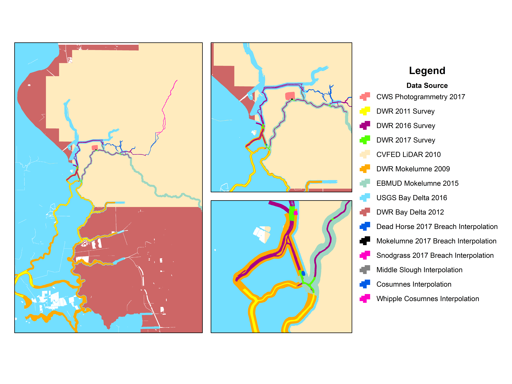
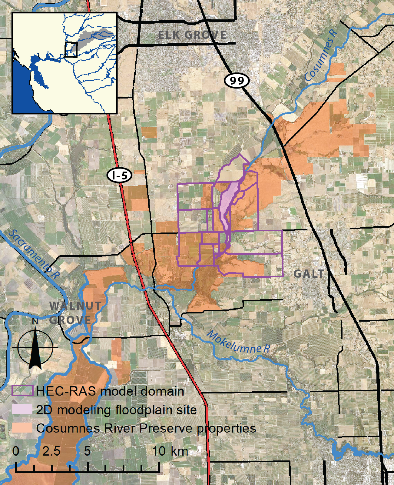

HYDRODYNAMIC MODELING METADATA FOR MCCORMACK-WILLIAMSON TRACT AREA

MCCORMACK-WILLIAMSON TRACT HYDRODYNAMIC MODELING – CWS
1.	Project/Model title: Hydrodynamic modeling of the McCormack-Williamson Tract
2.	Description: Calibrated 2D hydrodynamic model for the McCormack-Williamson Tract. Modeling is part of the UC Davis Center for Watershed Sciences McCormack-Williamson Tract Restoration Project funded by the Delta Science Program. 
3.	Contact information: Lily Tomkovic, UC Davis Center for Watershed Sciences, latomkovic@ucdavis.edu
4.	Geospatial extent: From Benson's Ferry down to Sacramento River at Rio Vista, and the Mokelumne at San Joaquin and Little Potato Slough; ~32 km2; In geodata folder see: Jan_30_2018_w_Tract_cut_Benson_6.shp and Jan_30_2018_w_Tract_cut_Benson_6_outline.shp
5.	Flows modeled: Model development in progress. Current geospatial extent is for flood conditions, when Benson's Ferry gage does not exhibit a tidal signal.
6.	Dimensions: 2D
7.	Resolution: The grid is an unstructured orthogonal grid with varying edge lengths and made up of triangles and quadrangle cells. The total number of cells is ~40,000. The shortest edge length is ~6m and the longest edge length is ~125m and the majority of cells are between 20 and 40 meters in length.
8.	Platform: Deltares D-Flow FM
9.	Calibrated and verification performed: In progress
10.	Purpose: For research and pairing with monitoring field data from 2016-2019. Intended for investigation of restoration impacts and developing predictive tools for zooplankton abundance in Delta floodplain restoration sites.
11.	Date of model completion: Model development in progress
12.	Date and resolution of underlying elevation data: Primary elevation data from 2007 LiDAR from the California Department of Water Resources Central Valley Floodplain Evaluation and Delineation (CVFED) project. Data was also used from USGS, EBMUD, and CWS. Here is a complete view of the data sources used to create the DEM for this model effort:

13.	Availability to public or third party entities: Please contact Lily Tomkovic (latomkovic@ucdavis.edu).

MCCORMACK-WILLIAMSON TRACT PROJECT PLANNING HYDRODYNAMIC MODELING – CBEC
1.	Project/Model title: Hydrodynamic modeling of the McCormack-Williamson Tract for restoration planning
2.	Description: 2D hydrodynamic modeling for the McCormack-Williamson Tract in support of restoration planning for The Nature Conservancy.
3.	Contact information: cbec eco engineering (info@cbecoeng.com)
4.	Geospatial extent: 
5.	Flows modeled: Model development in progress
6.	Dimensions: 2D
7.	Resolution:
8.	Platform: HEC-RAS 5.0
9.	Calibrated and verification performed:
10.	Purpose: 
11.	Date of model completion: Model development in progress
12.	Date and resolution of underlying elevation data: 
13.	Availability to public or third party entities: Please contact cbec eco engineering (info@cbecoeng.com).

LOWER COSUMNES RIVER FLOODPLAIN RIVER RESTORATION PROJECT HYDRODYNAMIC MODELING
1.	Project/Model title: Hydrodynamic modeling of the Lower Cosumnes River Floodplain Restoration project pre- and post-restoration
2.	Description: Calibrated 1D/2D models for both pre- and post-restoration conditions for the Lower Cosumnes River Floodplain Restoration project (implemented in 2014 by The Nature Conservancy). The modeling was conducted by Alison Whipple as part of her [dissertation](https://watershed.ucdavis.edu/library/managing-flow-regimes-and-landscapes-together-hydrospatial-analysis-evaluating) research and was part of the larger UC Davis Center for Watershed Sciences [Cosumnes Research Group Phase 3 project](https://watershed.ucdavis.edu/project/crg3). 
3.	Contact information: Alison Whipple, UC Davis Center for Watershed Sciences, aawhipple@ucdavis.edu
4.	Geospatial extent: Lower Cosumnes River Floodplain Restoration project site; ~2.1 km2; Model domain extends from ~2 km downstream of Highway 99 to ~5.5 km upstream of the Cosumnes R confluence with the Mokelumne R; In geodata folder see: LCRFR_ModelDom_2017.shp and LCRFR_2DArea_2015.shp; 

5.	Flows modeled: Calibration to ~80 m3/s; Validation to ~200 m3/s; Modeling performed for flows up to flow of record in daily time series (1,745 m3/s)
6.	Dimensions: 1D channel, 2D floodplain area
7.	Resolution: Cell size 110-4,200 m2 (flexible mesh), subgrid capacity of HEC-RAS 5.0 model allows for output at DEM resolution (1 m2). DEM based on 2007 LiDAR plus Real Time Kinematic (RTK) GPS survey data for areas altered with restoration. Channel bathymetry based on channel surface interpolation (within HEC-RAS) using cross-sections of ~200 m spacing.
8.	Platform: HEC-RAS 5.0, US Army Corps of Engineers 
9.	Calibrated and verification performed: Yes, calibration and validation performed for pre- and post-restoration conditions using in-channel and floodplain WSE.
10.	Purpose: Developed by Alison Whipple as part of her dissertation research on spatiotemporal quantification of floodplain inundation patterns. Informed the larger UC Davis Center for Watershed Sciences [Cosumnes Research Group Phase 3 project](https://watershed.ucdavis.edu/project/crg3).
11.	Date of model completion: 2017
12.	Date and resolution of underlying elevation data: Primary elevation data from 2007 LiDAR from the California Department of Water Resources Central Valley Floodplain Evaluation and Delineation (CVFED) project. Areas modified by restoration implementation were surveyed using RTK GPS in the fall of 2014 (shortly after project implementation). Most cross-sections used for channel surface interpolation were obtained in the summer of 2014. DEM resolution: 1 m2.
13.	Availability to public or third party entities: Please contact Alison Whipple (aawhipple@ucdavis.edu).

LOWER COSUMNES RIVER FLOODPLAIN RESTORATION PROJECT PLANNING HYDRODYNAMIC MODELING – RBI
1.	Project/Model title: Hydrodynamic modeling of the McCormack-Williamson Tract for restoration planning
2.	Description: 2D hydrodynamic modeling for the McCormack-Williamson Tract in support of restoration planning for The Nature Conservancy. See RBI_Flood Modeling Report-Final.pdf.
3.	Contact information: Robertson-Bryan, Inc
4.	Geospatial extent: 10.4 mi2, 5 mi of river channel. See [RBI report](documentation/RBI_Flood Modeling Report-Final.pdf).
5.	Flows modeled: 3.5-yr flood (12,800 cfs peak); 10-yr flood (32,600 cfs peak) 
6.	Dimensions: 1D/2D
7.	Resolution: Cell size 100x100 ft
8.	Platform: FLO-2D
9.	Calibrated and verification performed: Calibration for 12,800 cfs peak flow using inundation maps and aerial photographs taken the day after peak flow.
10.	Purpose: Lower Cosumnes River Floodplain Restoration Project Planning for The Nature Conservancy.
11.	Date of model completion: 2011
12.	Date and resolution of underlying elevation data: LiDAR 2005, DEM resolution: 1 m2.
13.	Availability to public or third party entities: Please contact Robertson-Bryan, Inc.

GRIZZLEY SLOUGH HYDRODYNAMIC MODELING – ESA
1.	Project/Model title: 
2.	Description: 
3.	Contact information: Matt Brennan, MBrennan@esassoc.com
4.	Geospatial extent: 
5.	Flows modeled: 
6.	Dimensions: 
7.	Resolution:
8.	Platform: 
9.	Calibrated and verification performed:
10.	Purpose: 
11.	Date of model completion: 
12.	Date and resolution of underlying elevation data: 
13.	Availability to public or third party entities:

REGIONAL HYDRODYNAMIC MODELING – RMA
1.	Project/Model title: 
2.	Description: 
3.	Contact information: 
4.	Geospatial extent: 
5.	Flows modeled: 
6.	Dimensions: 
7.	Resolution:
8.	Platform: 
9.	Calibrated and verification performed:
10.	Purpose: 
11.	Date of model completion: 
12.	Date and resolution of underlying elevation data: 
13.	Availability to public or third party entities:

LOWER COSUMNES RIVER HYDRODYNAMIC MODELING – FLEENOR
1.	Project/Model title: 
2.	Description:
3.	Contact information: William Fleenor, wefleenor@ucdavis.edu
4.	Geospatial extent: 
5.	Flows modeled: 
6.	Dimensions: 
7.	Resolution:
8.	Platform: HEC-RAS
9.	Calibrated and verification performed:
10.	Purpose: 
11.	Date of model completion: 
12.	Date and resolution of underlying elevation data: 
13.	Availability to public or third party entities: Please contact William Fleenor, wefleenor@ucdavis.edu.

LOWER COSUMNES RIVER HYDRODYNAMIC MODELING – MBK
1.	Project/Model title: 
2.	Description:
3.	Contact information: 
4.	Geospatial extent: 
5.	Flows modeled: 
6.	Dimensions: 
7.	Resolution:
8.	Platform: 
9.	Calibrated and verification performed:
10.	Purpose: 
11.	Date of model completion: 
12.	Date and resolution of underlying elevation data: 
13.	Availability to public or third party entities:

TRIANGLE RESTORATION SITE HYDRODYNAMIC MODELING – ANDREWS
1.	Project/Model title: Development and Application of a Two-Dimensional Hydrodynamic Model for Riverine Floodplain Environments
2.	Description: See [Andrews 2007 thesis](documentation/Andrews_2007_thesis.pdf)
3.	Contact information: 
4.	Geospatial extent: Lower Cosumnes River Triangle Restoration site; 0.36 km2, see [Andrews 2007 thesis](documentation/Andrews_2007_thesis.pdf)
5.	Flows modeled: 
6.	Dimensions: 2D
7.	Resolution:
8.	Platform: 2D model developed by Andrews
9.	Calibrated and verification performed: Calibration performed for February 18-24, 2004 flood event using WSE for several locations.
10.	Purpose: Thesis research
11.	Date of model completion: 2007
12.	Date and resolution of underlying elevation data: LiDAR 2005
13.	Availability to public or third party entities:

LOWER COSUMNES RIVER AND MCCORMACK-WILLIAMSON TRACT HYDRODYNAMIC MODELING – MOUGHAMIAN
1.	Project/Model title: Water Quality Modeling and Monitoring in the California North Delta Area
2.	Description: See [Moughamian 2005 thesis](documentation/Moughamian_2005_ThesisUCD_MWT.pdf)
3.	Contact information: 
4.	Geospatial extent: See [Moughamian 2005 thesis](documentation/Moughamian_2005_ThesisUCD_MWT.pdf)
5.	Flows modeled: 
6.	Dimensions: 1D
7.	Resolution:
8.	Platform: MIKE 11
9.	Calibrated and verification performed:
10.	Purpose: Thesis research
11.	Date of model completion: 2005
12.	Date and resolution of underlying elevation data: 
13.	Availability to public or third party entities: 

MCCORMACK-WILLIAMSON TRACT HYDRODYNAMIC MODELING – HAMMERSMARK
1.	Project/Model title: Hydrodynamic Modeling and GIS Analysis of the Habitat Potential and Flood Control Benefits of the Restoration of a Leveed Delta Island
2.	Description: See [Hammersmark 2003 thesis](documentation/Hammersmark-2003.pdf)
3.	Contact information: 
4.	Geospatial extent: See [Hammersmark 2003 thesis](documentation/Hammersmark-2003.pdf)
5.	Flows modeled: ~2.5-yr, ~5-yr, ~10-yr, ~25-yr
6.	Dimensions: 1D
7.	Resolution: 
8.	Platform: MIKE11
9.	Calibrated and verification performed: Yes, see [Hammersmark 2003 thesis](documentation/Hammersmark-2003.pdf)
10.	Purpose: 
11.	Date of model completion: 2002
12.	Date and resolution of underlying elevation data: See [Hammersmark 2003 thesis](documentation/Hammersmark-2003.pdf)
13.	Availability to public or third party entities:

LOWER COSUMNES RIVER HYDRODYNAMIC MODELING – BLAKE
1.	Project/Model title: An Unsteady Hydraulic Surface Water Model of the Lower Cosumnes River, California, for the Investigation of Floodplain Dynamics
2.	Description: See [Blake 2001 thesis](documentation/Blake_2001_thesis.pdf)
3.	Contact information: 
4.	Geospatial extent: See [Blake 2001 thesis](documentation/Blake_2001_thesis.pdf)
5.	Flows modeled: ~2.5-yr, ~5-yr, ~10-yr
6.	Dimensions: 1D
7.	Resolution:
8.	Platform: MIKE11
9.	Calibrated and verification performed: Yes, see [Blake 2001 thesis](documentation/Blake_2001_thesis.pdf)
10.	Purpose: 
11.	Date of model completion: 2001
12.	Date and resolution of underlying elevation data: See [Blake 2001 thesis](documentation/Blake_2001_thesis.pdf)
13.	Availability to public or third party entities:

